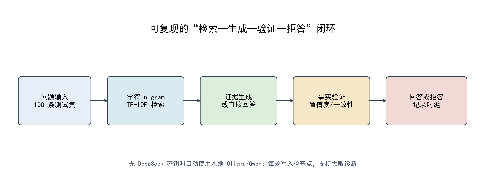
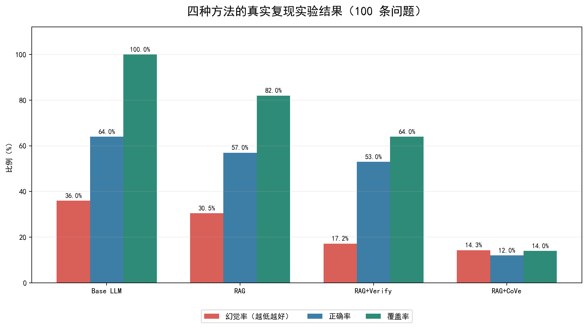
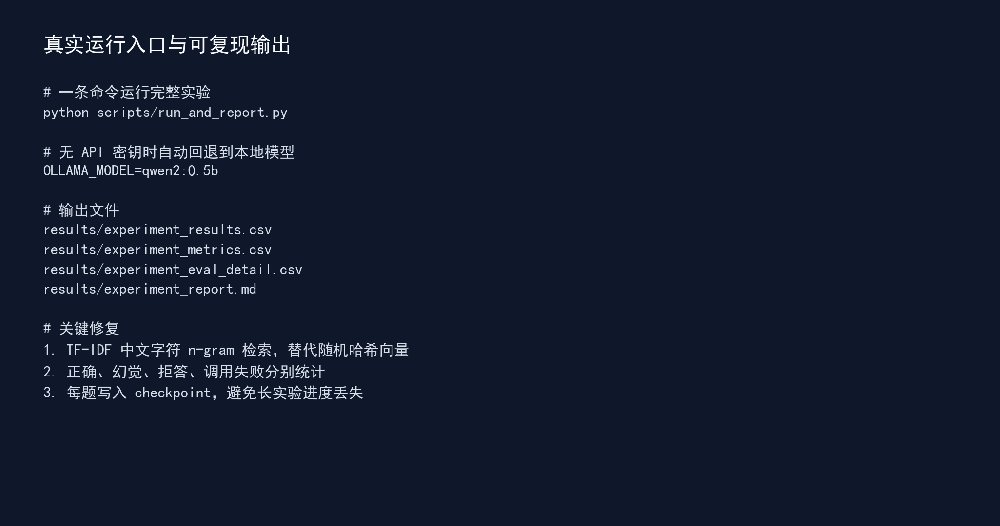

# HallucinationGuard-RAG

> 一个可离线复现的大语言模型幻觉检测与缓解实验框架，比较 Base LLM、RAG、RAG + Verify 与 RAG + CoVe 四种方法。

[](https://www.python.org/)
[](LICENSE)
[](#快速开始)
[](data/test_dataset.json)

## 项目简介

本项目源自《人工智能基础》课程研究，围绕“检索—生成—验证—拒答”闭环，实现并评估四种大语言模型问答方案：

| 方法 | 实现思路 | 主要作用 |
|---|---|---|
| Base LLM | 本地模型直接回答 | 提供无外部证据的对照组 |
| RAG | 中文字符 n-gram TF-IDF 检索 | 用知识库证据约束回答 |
| RAG + Verify | 检索置信度与候选间隔验证 | 证据模糊时主动拒答 |
| RAG + CoVe | 关键词独立核查与一致性门控 | 更保守地降低无证据作答 |

项目包含 100 条事实性测试问题、101 个证据或干扰文档、完整原始回答、逐题评分和汇总指标。

## 为什么重构这个项目

原始实验出现了“四种方法幻觉率均接近 100%”的异常结果。复查后发现问题主要来自实验实现，而非模型全部答错：

1. **评测器过严**：要求标准答案整句原样出现在回答中，正确改写也会被判错。
2. **检索降级失效**：BGE 不可用时退化为随机哈希向量，检索结果几乎无语义。
3. **失败样本混算**：API 调用失败、拒答和事实错误全部被计算为幻觉。
4. **长实验无检查点**：运行中断后无法保留已完成进度。

修复后的实现分别统计正确、幻觉、覆盖和调用失败，并保存每道题的回答与检索上下文。

## 系统架构



## 实验结果

本地环境真实运行 100 条问题后的结果：

| 方法 | 幻觉率 ↓ | 正确率 ↑ | 覆盖率 ↑ | 平均时延 |
|---|---:|---:|---:|---:|
| Base LLM | 36.0% | 64.0% | 100.0% | 2.6891 s |
| RAG | 30.5% | 57.0% | 82.0% | 0.0005 s |
| RAG + Verify | 17.2% | 53.0% | 64.0% | 0.0003 s |
| RAG + CoVe | 14.3% | 12.0% | 14.0% | 0.0004 s |



**核心结论：** 验证与拒答可以显著降低实际作答中的幻觉，但阈值过严会明显降低覆盖率。低幻觉率不能单独代表系统高可用。

## 快速开始

### 1. 克隆并安装依赖

```bash
git clone https://github.com/2031945467-spec/HallucinationGuard-RAG.git
cd HallucinationGuard-RAG

python -m venv .venv
```

Windows PowerShell：

```powershell
.\.venv\Scripts\Activate.ps1
pip install -r requirements.txt
```

Linux / macOS：

```bash
source .venv/bin/activate
pip install -r requirements.txt
```

### 2. 准备模型

默认使用本地 Ollama，无需 API 密钥：

```bash
ollama pull qwen2:0.5b
```

也可以复制 `.env.example` 为 `.env`，填写 `DEEPSEEK_API_KEY` 后使用 DeepSeek。

### 3. 运行完整实验

```bash
python scripts/run_and_report.py
```

只重新评价已有回答，不调用模型：

```bash
python scripts/run_and_report.py --evaluate-only
```

重新生成论文和汇报使用的图：

```bash
python scripts/generate_figures.py
```



## 输出文件

| 文件 | 内容 |
|---|---|
| `results/experiment_results.csv` | 原始回答、时延与检索上下文 |
| `results/experiment_eval_detail.csv` | 逐题正确、幻觉、拒答和支持分 |
| `results/experiment_metrics.csv` | 四种方法汇总指标 |
| `results/experiment_report.md` | 自动生成的实验报告 |
| `results/figures/` | 系统架构、运行演示与实验结果图 |

## 项目结构

```text
HallucinationGuard-RAG/
├─ data/
│  ├─ raw_docs/knowledge.txt       # 101 个知识库文档
│  └─ test_dataset.json            # 100 条测试问题
├─ docs/
│  └─ EXPERIMENT.md                # 实验设计与复现说明
├─ results/
│  ├─ figures/                     # 运行与结果截图
│  ├─ experiment_results.csv       # 原始实验输出
│  └─ experiment_metrics.csv       # 汇总指标
├─ scripts/
│  ├─ run_and_report.py            # 一键实验入口
│  └─ generate_figures.py          # 图表生成
└─ src/
   ├─ pipelines/                   # 四种实验管线
   ├─ config.py                    # Ollama / DeepSeek 客户端
   └─ retriever.py                 # TF-IDF 检索器
```

## 评测口径

- **正确率**：回答覆盖标准答案关键事实的样本比例。
- **幻觉率**：实际作答样本中，未覆盖标准事实且未拒答的比例。
- **覆盖率**：系统实际给出事实性回答的比例。
- **失败率**：模型服务连接、超时或调用失败的比例。

评测实现还会检查标准答案中的数值是否在回答中保持一致。

## 局限性

- 测试集规模为课程级 100 条，不能代替大型公开基准。
- TF-IDF 适合离线复现，但语义检索能力弱于高质量向量模型。
- CoVe 当前采用保守阈值，幻觉率较低但覆盖率不足。
- 自动评测仍可能存在边界误判，重要结论应结合逐题结果人工复核。

## 许可证

代码采用 [MIT License](LICENSE)。数据、论文和汇报仅用于教学与研究展示。
